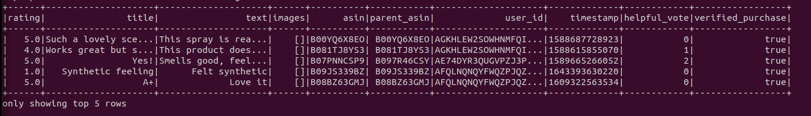
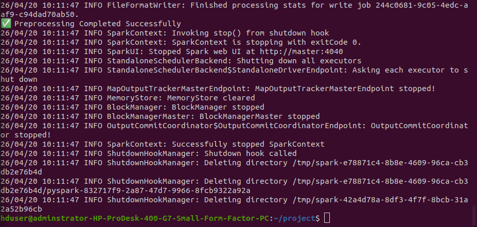
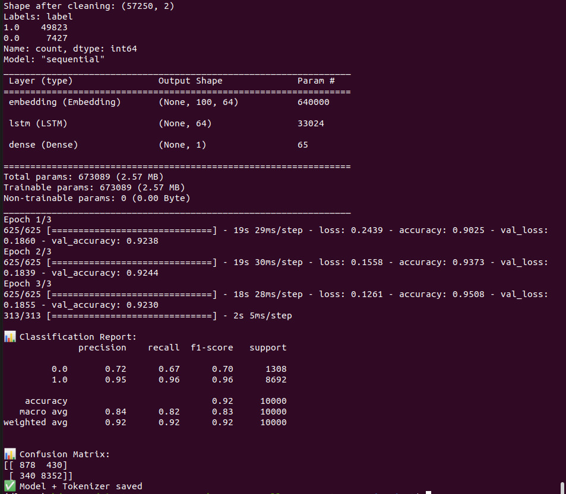
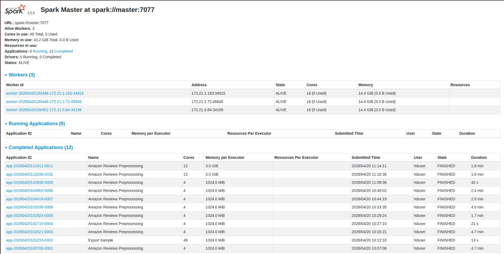
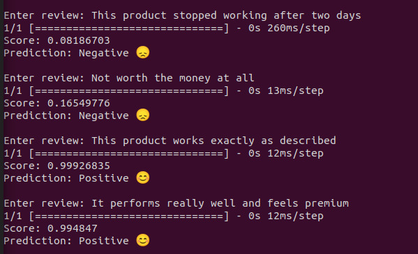

# 📊 Amazon Reviews Sentiment Analysis (Big Data + Deep Learning)

## 🚀 Project Overview
This project implements an end-to-end Big Data pipeline for sentiment analysis on the Amazon Reviews dataset. It utilizes **Hadoop HDFS** for distributed storage, **Apache Spark (PySpark)** for large-scale preprocessing, and **Deep Learning (TensorFlow/Keras)** for classification.

The system evolves from a frequency-based TF-IDF model to a context-aware **LSTM model**, enabling superior handling of complex linguistic patterns and negation (e.g., "Not Good").

---

## 🏗️ Dataset


1. **Amazon Reviews Dataset**: Ingested from HuggingFace.  
2. **HDFS Storage**: Distributed storage for raw and processed data.  
3. **Spark Preprocessing**: Cleaning, labeling, and balanced sampling.  
4. **Modeling**:  
   - **ANN Path**: TF-IDF Features → Artificial Neural Network  
   - **LSTM Path**: Tokenized Raw Text → Long Short-Term Memory Network  
5. **Evaluation**: Metric analysis and real-world prediction  

---

## ⚙️ Technologies Used
- **Storage:** Hadoop (HDFS)  
- **Processing:** Apache Spark (PySpark)  
- **Deep Learning:** TensorFlow / Keras  
- **Languages:** Python (Pandas, NumPy, Scikit-learn)  
- **Environment:** Linux (Ubuntu)  

---

## 📂 Dataset Source
- **Source:** Amazon Reviews Dataset (HuggingFace)  
- **Format:** Parquet (stored in HDFS)  

**Fields:**
- `text` → Review content  
- `rating` → Numerical score (converted into sentiment labels)  

---

## 🔄 Data Processing Pipeline

### 🔹 Preprocessing
- Remove null values and punctuation  
- Lowercase conversion & tokenization  
- Stopword removal  

**Labeling:**
- `Rating >= 3` → **Positive (1)**  
- `Rating < 3` → **Negative (0)**  

---

### 🔹 Feature Engineering
- **TF-IDF Model:** HashingTF + IDF vectorization  
- **LSTM Model:** Text → sequences → padded inputs (length = 100)  



---

## 🤖 Models Implemented

### 1. TF-IDF + ANN
- Uses vectorized frequency features  
- **Pros:** Fast  
- **Cons:** No context understanding  

---

### 2. LSTM Model

Embedding → LSTM → Dense → Output

- Captures word order and dependencies  
- Handles phrases like **"not worth the money"**


---

## 🏋️ Training Details
- Dataset size: ~50,000 samples (balanced)  
- Train/Test split: 80 / 20  
- Vocabulary size: 10,000  
- Sequence length: 100  
- Epochs: 3–5  
- Batch size: 64  
- Training: CPU-based  



---

## 🖥️ Spark Cluster Configuration
- 3 Worker Nodes  
- 48 Total Cores  
- ~43 GB RAM  



---

## 🧪 Results & Predictions

**Metrics Used:**
- Accuracy  
- Precision  
- Recall  
- F1-score  

### Example Predictions

| Input | Prediction |
|------|-----------|
| This product stopped working after two days | Negative |
| Not worth the money at all | Negative |
| This product works exactly as described | Positive |



---

## 📁 Project Structure


	├── preprocessing.py
	├── dl_model.py
	├── lstm_model.py
	├── predict_lstm.py
	├── tokenizer.pkl
	├── sentiment_model.h5
	├── lstm_model.keras
	└── screenshot_*.png

---

## ▶️ How to Run

### 1. Run Spark Preprocessing
```bash
spark-submit \
--master spark://master:7077 \
--executor-memory 3G \
--total-executor-cores 12 \
preprocessing.py
```

2. Download Processed Data
```bash
hdfs dfs -get /bda/lstm_data/* .
cat part-* > lstm_data.csv
```
3. Train Model
```bash
source ~/dl_env/bin/activate
python lstm_model.py
```
4. Run Prediction
```bash
python predict_lstm.py
```

⸻

🔮 Future Improvements
	•	Use Transformer models (BERT / RoBERTa)
	•	Deploy via FastAPI / Flask
	•	Add real-time streaming pipeline
	•	Improve spelling & sarcasm handling

⸻

👨‍💻 Authors 

	•	Kanhaiya Chhaparwal (U23AI103) 
	•	Anuj Sule (U23AI078)
	•	Devansh Upadhyay (U23AI104)
	•	Yuvraj Srivastva (U23AI097)

